# MAVIS - Scalable Visualization and Explainability of Synthetic Datasets

A full-stack web application for visualizing and comparing real and synthetic datasets using advanced dimensionality reduction techniques. MAVIS provides an intuitive interface for data scientists and researchers to analyze synthetic data quality through interactive visualizations and statistical comparisons.

## 🚀 Features

- **Interactive Data Upload**: Support for CSV, Excel, and JSON file formats
- **Advanced Dimensionality Reduction**: UMAP and t-SNE implementations with configurable parameters
- **Interactive Visualizations**: 
  - Zoomable and pannable scatter plots with D3.js
  - Real-time point selection and filtering
  - Collapsible distribution sidebar with responsive legend positioning
- **Statistical Analysis**: 
  - Distribution comparisons between real and synthetic data
  - Histogram and violin plot visualizations
  - Categorical and continuous variable analysis
- **Modern UI/UX**: 
  - Material-UI components with responsive design
  - Clean, professional interface optimized for data exploration
  - Full-screen visualization capabilities

## 🏗️ Architecture Overview

The following diagram illustrates MAVIS's complete system architecture, showing the relationships between frontend components, backend services, and external dependencies:

```mermaid
graph TB
    %% User Layer
    User[👤 User] --> Frontend{Frontend<br/>React App}
    
    %% Frontend Components
    Frontend --> Auth[🔐 Authentication<br/>AuthContext]
    Frontend --> Header[📋 Header<br/>Navigation]
    Frontend --> Sidebar[📂 Sidebar<br/>File Upload]
    Frontend --> EmbedPlot[📊 EmbeddingPlot<br/>Interactive Scatter Plot]
    Frontend --> DistPlot[📈 DistributionPlot<br/>Statistical Comparisons]
    Frontend --> History[📜 History<br/>Job Management]
    Frontend --> Results[📄 ResultsPane<br/>Analysis Results]
    
    %% Frontend Hooks & Services
    Frontend --> DataHook[🔄 useDataUpload<br/>File Processing]
    Frontend --> EmbedHook[🔄 useEmbedding<br/>Visualization Logic]
    Frontend --> API[🌐 API Service<br/>HTTP Client]
    
    %% Backend Entry Point
    API -->|HTTP Requests| Backend{Backend<br/>FastAPI App}
    
    %% Backend Routes
    Backend --> EmbedRoute[📍 /embed<br/>Embedding Computation]
    Backend --> DistRoute[📍 /distribution<br/>Statistical Analysis]
    Backend --> HistRoute[📍 /history<br/>Job History]
    Backend --> HealthRoute[📍 /health<br/>Status Check]
    
    %% Backend Services
    EmbedRoute --> EmbedService[⚙️ Embedding Service<br/>UMAP/t-SNE Processing]
    EmbedRoute --> JobService[💼 Job Service<br/>Background Processing]
    DistRoute --> DataPreproc[🔧 Data Preprocessing<br/>Validation & Cleaning]
    HistRoute --> JobService
    
    %% Data Processing Pipeline
    EmbedService --> UMAP[🎯 UMAP<br/>Dimensionality Reduction]
    EmbedService --> TSNE[🎯 t-SNE<br/>Dimensionality Reduction]
    EmbedService --> OneHot[🔄 One-Hot Encoding<br/>Categorical Processing]
    
    %% Database Layer
    JobService --> Database[(🗄️ SQLite Database<br/>mavis_dev.db)]
    
    %% File System
    Sidebar -->|File Upload| FileSystem[📁 File System<br/>CSV/Excel/JSON]
    
    %% External Libraries & Dependencies
    UMAP --> UMAPLib[📚 umap-learn]
    TSNE --> TSNELib[📚 openTSNE]
    EmbedPlot --> D3[📚 D3.js<br/>Interactive Visualization]
    DistPlot --> Plotly[📚 Plotly.js<br/>Statistical Charts]
    Frontend --> MUI[📚 Material-UI<br/>Component Library]
    
    %% Deployment & Infrastructure
    Backend --> Docker[🐳 Docker<br/>Containerization]
    Frontend --> Docker
    Docker --> DockerCompose[🔧 Docker Compose<br/>Multi-Service Setup]
    
    %% Configuration & Environment
    Backend --> Config[⚙️ Config<br/>Environment Settings]
    Config --> EnvFile[📄 environment.yml<br/>Conda Dependencies]
    
    %% Testing Infrastructure
    Frontend --> FrontendTests[🧪 Frontend Tests<br/>Jest + React Testing Library]
    Backend --> BackendTests[🧪 Backend Tests<br/>pytest]
    
    %% Monitoring & Logging
    Backend --> Monitoring[📊 Monitoring Service<br/>Metrics Collection]
    Backend --> Logging[📝 Logging<br/>Application Logs]
    
    %% Data Flow
    User -.->|1. Upload Data| FileSystem
    FileSystem -.->|2. Process Files| DataHook
    DataHook -.->|3. Send to Backend| API
    API -.->|4. Compute Embeddings| EmbedService
    EmbedService -.->|5. Return Results| EmbedPlot
    EmbedPlot -.->|6. Interactive Visualization| User
    
    %% Styling
    classDef frontend fill:#e1f5fe,stroke:#01579b,stroke-width:2px
    classDef backend fill:#f3e5f5,stroke:#4a148c,stroke-width:2px
    classDef service fill:#fff3e0,stroke:#e65100,stroke-width:2px
    classDef data fill:#e8f5e8,stroke:#1b5e20,stroke-width:2px
    classDef external fill:#fce4ec,stroke:#880e4f,stroke-width:2px
    classDef infra fill:#f1f8e9,stroke:#33691e,stroke-width:2px
    
    class Frontend,Auth,Header,Sidebar,EmbedPlot,DistPlot,History,Results,DataHook,EmbedHook,API,FrontendTests frontend
    class Backend,EmbedRoute,DistRoute,HistRoute,HealthRoute,BackendTests backend
    class EmbedService,JobService,DataPreproc,Monitoring,Logging service
    class Database,FileSystem,Config,EnvFile data
    class UMAPLib,TSNELib,D3,Plotly,MUI external
    class Docker,DockerCompose infra
```



### Key Architecture Components:

- **Frontend (Light Blue)**: React-based user interface with Material-UI components, custom hooks for state management, and interactive visualization components
- **Backend (Purple)**: FastAPI application with RESTful routes for embedding computation, statistical analysis, and job management
- **Services (Orange)**: Core business logic including embedding computation, job processing, and data preprocessing
- **Data Layer (Green)**: SQLite database for persistence and file system integration for data uploads
- **External Libraries (Pink)**: Scientific computing libraries (UMAP, t-SNE), visualization frameworks (D3.js, Plotly), and UI components
- **Infrastructure (Light Green)**: Docker containerization and deployment configuration

The numbered data flow shows the typical user journey from data upload through processing to interactive visualization.

## 📁 Project Structure

```
.
├── backend/                 # FastAPI backend
│   ├── main.py             # Main FastAPI application
│   ├── config.py           # Configuration settings
│   ├── services/          # Business logic services
│   │   └── embedding.py   # Embedding computation service
│   ├── routes/            # API route handlers
│   │   ├── embed.py       # Embedding endpoints
│   │   └── distribution.py # Distribution analysis endpoints
│   └── utils/             # Utility functions and data processing
│       ├── data_preprocessing.py
│       └── validation.py
├── frontend/               # React frontend application
│   ├── public/            # Static files
│   ├── src/               # Source code
│   │   ├── components/    # React components
│   │   │   ├── EmbeddingPlot.js    # Main visualization component
│   │   │   ├── DistributionPlot.js # Distribution analysis
│   │   │   ├── Header.js           # Navigation header
│   │   │   ├── LandingPage.js      # Welcome page
│   │   │   ├── Login.js            # Authentication
│   │   │   ├── ResultsPane.js      # Results display
│   │   │   └── Sidebar.js          # Navigation sidebar
│   │   ├── services/     # API communication
│   │   │   └── api.js
│   │   ├── hooks/        # Custom React hooks
│   │   │   ├── useDataUpload.js
│   │   │   └── useEmbedding.js
│   │   ├── contexts/     # React contexts
│   │   │   └── AuthContext.js
│   │   └── utils/        # Frontend utilities
│   │       ├── dataUtils.js
│   │       ├── fileReader.js
│   │       └── security.js
│   └── package.json      # Node.js dependencies
├── notebooks/             # Jupyter notebooks for development
├── reports/               # Generated reports and figures
├── environment.yml        # Conda environment specification
└── README.md             # Project documentation
```

## 🛠️ Setup

### Prerequisites
- [Anaconda](https://www.anaconda.com/products/distribution) or [Miniconda](https://docs.conda.io/en/latest/miniconda.html)
- [Node.js](https://nodejs.org/) (v16 or higher)

### Backend Setup

#### Option 1: Using Conda (Recommended)
1. Create and activate conda environment:
```bash
conda env create -f environment.yml
conda activate mavis
```

2. Run the backend server:
```bash
cd backend
python main.py
```

#### Option 2: Using pip
1. Create and activate virtual environment:
```bash
python -m venv venv
# Windows:
venv\Scripts\activate
# Linux/macOS:
source venv/bin/activate
```

2. Install dependencies:
```bash
pip install fastapi uvicorn numpy pandas scikit-learn matplotlib seaborn openTSNE umap-learn python-dotenv plotly pydantic statsmodels
```

3. Run the backend server:
```bash
cd backend
python main.py
```

The backend will be available at http://localhost:8000

### Frontend Setup

#### Development
1. Install Node.js dependencies:
```bash
cd frontend
npm install
```

2. Start the development server:
```bash
npm start
```

The frontend will be available at http://localhost:3000

#### Production Build
1. Build the production bundle:
```bash
cd frontend
npm run build
```

2. The optimized static files will be in `frontend/build/` directory

## 📊 Usage

1. **Upload Data**: Navigate to the Data Upload tab and select your real and synthetic datasets
2. **Configure Parameters**: Choose embedding method (UMAP/t-SNE) and adjust parameters
3. **Generate Embeddings**: Click "Generate Embeddings" to create visualizations
4. **Explore Results**: 
   - Use the interactive scatter plot to explore data distribution
   - Toggle the distribution sidebar to view statistical comparisons
   - Select points to analyze specific data subsets
5. **Export Results**: Save visualizations and analysis reports

## 🎯 UMAP Configuration & Parameters

UMAP (Uniform Manifold Approximation and Projection) is a powerful dimensionality reduction technique that preserves both local and global data structures. MAVIS provides comprehensive parameter control for optimal visualization results.

### Key UMAP Parameters

| Parameter | Range | Default | Description | Use Case |
|-----------|-------|---------|-------------|----------|
| **n_neighbors** | 2-200 | 15 | Number of neighboring points used in local approximations | • **Low (2-10)**: Focus on local structure, fine details<br/>• **High (50-200)**: Emphasize global structure, broad patterns |
| **min_dist** | 0.0-0.99 | 0.1 | Minimum distance between points in low-dimensional space | • **Low (0.0-0.1)**: Tight clusters, detailed structure<br/>• **High (0.5-0.99)**: Spread out points, overview perspective |
| **n_components** | 2-3 | 2 | Target dimensionality for visualization | • **2D**: Standard scatter plots, easier interpretation<br/>• **3D**: Enhanced cluster separation, spatial relationships |
| **metric** | Various | euclidean | Distance metric for high-dimensional space | • **euclidean**: Continuous numerical data<br/>• **manhattan**: Sparse or categorical data<br/>• **cosine**: Text or high-dimensional sparse data |


### UMAP Functionality Features

#### 🔧 **Interactive Parameter Tuning**
- **Real-time Preview**: Adjust parameters and see immediate effects on visualization
- **Parameter Presets**: Quick-select configurations for different data types:
  - *Detailed View*: n_neighbors=5, min_dist=0.05 (fine-grained analysis)
  - *Balanced View*: n_neighbors=15, min_dist=0.1 (default, general purpose)
  - *Overview Mode*: n_neighbors=50, min_dist=0.5 (broad patterns)

#### 📊 **Advanced Visualization Options**
- **Color Mapping**: 
  - Categorical variables with distinct color palettes
  - Continuous variables with gradient color scales
  - Custom color schemes for accessibility
- **Point Styling**:
  - Adjustable point sizes for data density representation
  - Opacity control for overlapping point visualization
  - Shape differentiation for multiple categories

#### ⚡ **Performance Optimization**
- **Batch Processing**: Handles large datasets (>100k points) efficiently
- **Progressive Rendering**: Shows intermediate results during computation
- **Memory Management**: Automatic optimization for available system resources
- **Background Processing**: Non-blocking computation with progress indicators

#### 🎨 **Interactive Features**
- **Zoom & Pan**: Smooth navigation through embedding space
- **Point Selection**: Click and drag to select data subsets
- **Hover Information**: Detailed tooltips showing original data values
- **Real vs Synthetic Toggle**: Switch between dataset visualizations

## 📈 Distribution Analysis & Chart Functionalities

MAVIS provides comprehensive statistical comparison tools through interactive distribution visualizations, enabling detailed quality assessment of synthetic data.

### Distribution Chart Types

MAVIS automatically selects appropriate chart types based on your data:

**For Numeric/Continuous Variables:**
- **Histogram**: Default for continuous data
- **Violin Plot**: Alternative showing density distributions with quartile information

**For Categorical Variables:**
- **Bar Chart**: Frequency/percentage comparisons between categories

#### 📊 **Histogram Comparisons**
- **Overlapping Histograms**: Direct visual comparison of real vs synthetic distributions
- **Customizable Binning**: 
  - Automatic optimal bin selection using Sturges' rule  
  - Adaptive binning for different data ranges
- **Statistical Overlays**:
  - Mean and median lines with confidence intervals
  - Standard deviation bands
  - Quartile markers and outlier identification

#### 🎻 **Violin Plots**
- **Density Estimation**: Kernel density estimation for smooth distribution curves
- **Embedded Box Plot**: Quartile information (Q1, median, Q3) displayed within violin shape
- **Mean Line**: Clearly marked mean value for quick reference  
- **Comparative Layout**: Side-by-side real vs synthetic comparisons
- **Interactive Features**:
  - Hover to see exact density values
  - Clear visualization of distribution shape and spread
  - Automatic bandwidth optimization for optimal density curves

#### 🔄 **Categorical Distribution Charts**
- **Bar Charts**: Frequency comparisons for categorical variables
- **Proportional Analysis**: Percentage-based comparisons
- **Chi-square Integration**: Statistical significance testing for category distributions
- **Missing Value Analysis**: Visualization of data completeness

### Distribution Functionality Features

#### 🎛️ **Interactive Controls**
- **Variable Selection**: 
  - Dropdown menu for quick variable switching
  - Multi-variable comparison in grid layout
  - Search and filter capabilities for large datasets
- **Chart Type Toggle**: Seamless switching between histogram and violin plots (numeric data) or bar charts (categorical data)
- **Scale Options**:
  - Linear vs logarithmic scaling
  - Normalized vs absolute count scales
  - Percentage vs frequency displays

#### 📊 **Statistical Analysis Integration**
- **Kolmogorov-Smirnov (KS) Test**: Automated distribution similarity testing for continuous variables (tests if two datasets come from the same distribution)
- **Chi-square Test**: Categorical distribution comparison with statistical significance testing
- **Effect Size Calculation**: Cohen's d for practical significance assessment beyond statistical significance
- **Confidence Intervals**: Bootstrap-based uncertainty quantification for robust statistical inference

#### 🎨 **Visualization Enhancements**
- **Color Coding**: 
  - Consistent real (blue) vs synthetic (orange) color scheme
  - Accessibility-friendly color palettes
  - Custom theme support
- **Annotation System**:
  - Statistical test results displayed on charts
  - Significance indicators (*, **, ***)
  - Effect size interpretations

#### 📱 **Responsive Design**
- **Collapsible Sidebar**: Space-efficient design for different screen sizes
- **Mobile Optimization**: Touch-friendly controls and gesture support
- **Export Options**:
  - High-resolution PNG/SVG downloads
  - PDF report generation with all charts
  - CSV data export for external analysis

#### 🔍 **Advanced Features**
- **Distribution Filtering**: 
  - Filter by value ranges to focus on specific data regions
  - Exclude outliers for cleaner comparisons
  - Subset analysis based on other variables
- **Real-time Updates**: 
  - Dynamic chart updates when embedding selection changes
  - Synchronized highlighting between scatter plot and distributions
  - Live statistical recalculation

### Quality Assessment Indicators

#### ⚠️ **Visual Alert System**
- **Distribution Mismatch Warnings**: Automatic detection of significant differences
- **Sample Size Alerts**: Warnings for insufficient data in categories
- **Data Quality Flags**: Missing values, extreme outliers, or unusual patterns

#### 📋 **Statistical Summary Panel**
- **Key Metrics Dashboard**: Mean, std, skewness, kurtosis comparisons
- **Similarity Scores**: Overall distribution similarity percentages
- **Recommendation Engine**: Automated suggestions for data generation improvement

## 🔧 API Documentation

Once the backend is running, visit http://localhost:8000/docs for the interactive API documentation powered by FastAPI's automatic OpenAPI generation.

## 🚀 Production Deployment

### Backend Deployment

#### Using uvicorn:
```bash
# From project root
uvicorn backend.main:app --host 0.0.0.0 --port 8000 --workers 4
```

#### Using gunicorn (recommended):
```bash
gunicorn backend.main:app -w 4 -k uvicorn.workers.UvicornWorker --bind 0.0.0.0:8000
```

### Frontend Deployment

#### Static File Server (nginx):
```nginx
server {
    listen 80;
    server_name your-domain.com;
    
    location / {
        root /path/to/frontend/build;
        try_files $uri $uri/ /index.html;
    }
    
    location /api {
        proxy_pass http://localhost:8000;
        proxy_set_header Host $host;
        proxy_set_header X-Real-IP $remote_addr;
        proxy_set_header X-Forwarded-For $proxy_add_x_forwarded_for;
        proxy_set_header X-Forwarded-Proto $scheme;
    }
}
```

#### Docker Deployment:
```dockerfile
# Multi-stage build
FROM python:3.10-slim as backend
WORKDIR /app
COPY environment.yml .
RUN pip install conda && conda env create -f environment.yml
COPY backend/ ./backend/
EXPOSE 8000
CMD ["uvicorn", "backend.main:app", "--host", "0.0.0.0", "--port", "8000"]

FROM node:18-alpine as frontend
WORKDIR /app
COPY frontend/package*.json ./
RUN npm ci --only=production
COPY frontend/ .
RUN npm run build

FROM nginx:alpine
COPY --from=frontend /app/build /usr/share/nginx/html
COPY nginx.conf /etc/nginx/nginx.conf
EXPOSE 80
```

## 🧪 Development

### Code Quality
Make sure the conda environment is activated (`conda activate mavis`), then run:

```bash
# Format code
black .
isort .

# Lint code
flake8 .
```

### Testing
```bash
# Backend tests
cd backend
python -m pytest

# Frontend tests
cd frontend
npm test
```

### Project Maintenance
Use the cleanup script to manage redundant files and keep the project lean:

```bash
# Run the cleanup script
python scripts/cleanup.py
```

This script will:
- Remove Python cache directories (`__pycache__`)
- Clean Jupyter notebook checkpoints (`.ipynb_checkpoints`)
- Clear outputs from Jupyter notebooks to reduce size
- Clean up large generated report files (keeping samples)
- Remove `node_modules` if present
- Show project size analysis

## 🤝 Contributing

1. Fork the repository
2. Create a feature branch (`git checkout -b feature/amazing-feature`)
3. Commit your changes (`git commit -m 'Add some amazing feature'`)
4. Push to the branch (`git push origin feature/amazing-feature`)
5. Open a Pull Request

## 📄 License

This project is licensed under the MIT License - see the [LICENSE](LICENSE) file for details.

## 🙏 Acknowledgments

- Built with [FastAPI](https://fastapi.tiangolo.com/) and [React](https://reactjs.org/)
- Visualization powered by [D3.js](https://d3js.org/) and [Plotly](https://plotly.com/)
- Dimensionality reduction using [UMAP](https://umap-learn.readthedocs.io/) and [openTSNE](https://opentsne.readthedocs.io/)
- UI components from [Material-UI](https://mui.com/)

